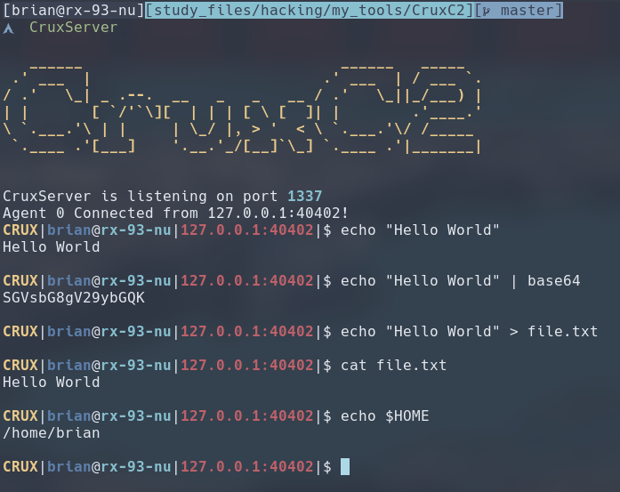

# CruxC2
> If any man will come after me, let him deny himself, and take up his **cross**, and follow me\
> -- Matthew 16:24

CruxC2 is a lightweight C2 Framework for use with Penetration Testing, CTFs, and Red Team engagements. It consists of these two components:
1. CruxAgent: Executed on the target system and connects back to the CruxServer.
2. CruxServer: Listener on which operators can issue commands to CruxAgents

## Implemented & Planned Features:
The following features are currently implemented:
- [x] Interactive shell session
- [x] Setting Variables
- [x] TLS encrypted transport

The following features are currently planned, in the order that it will be implemented:
- [ ] Remote termination of running command via Ctrl+C
- [ ] File upload/download
- [ ] Ability to edit remote files
- [ ] Establish Persistence to avoid re-running exploit
- [ ] Support for Linux and Windows Targets

## Build Instruction
To build CruxC2 from source, simply clone the repo and run `cargo build`.
```
$ git clone https://github.com/RandomChugokujin/CruxC2
$ cargo build --release
```

The binaries (`CruxAgent` and `CruxServer`) will be available at `target/release/`.
```
$ ls target/release
build  CruxAgent  CruxAgent.d  CruxServer  CruxServer.d  deps  examples  incremental
```

## CruxAgent
CruxAgent is the component of the C2 that provides server control over the target. It should be transferred onto the target machine and executed like following:
```
$ CruxAgent --help
A simple Command & Control Agent inside the CruxC2 framework.

Usage: CruxAgent [OPTIONS] <RHOST>

Arguments:
  <RHOST>  Remote host to connect to (mandatory)

Options:
  -p, --port <RPORT>  Remote port to connect to (short -p) [default: 1337]
  -h, --help          Print help
  -V, --version       Print version
```

## CruxServer
CruxServer will listen for incoming connections (on port 1337 by default) much like a reverse shell listener when launched.
```
A simple Command & Control Server inside the CruxC2 framework.

Usage: CruxServer [OPTIONS]

Options:
  -p, --port <PORT>             The port to listen on [default: 1337]
  -f, --pkcs12-path <IDENTITY>  PKCS12 Identity File path [default: $HOME/.config/CruxC2/identity.pfx]
```

On first launch, CruxServer will generate a self-signed identity file in `$HOME/.config/CruxC2/identity.pfx` to support the TLS encryption. It will also ask you to provide a password to protect it.
Please remember the password you set for your identity file. If you forgot your password, you have to remove the identity file, re-run `CruxServer` to generate it again.

After the agent connects, the operator will be presented with with a clean interactive shell session with readline features such as up/down arrows to cycle through command history and moving the cursor with left/right arrow to edit commands.

Operator can execute most shell commands with different shell operators (`>`, `|`, etc.). Shell and environment variable subsitution is also implemented via the `setvar` command for shell variables and `export` command for environment variables.



For special shell commands, please see wiki.

## Disclaimer
This project is for educational or red teaming use in controlled, authorized environments only. Any misuse against unauthorized systems is illegal and strictly discouraged.

## License
This project is distributed under GPLv3 license.
